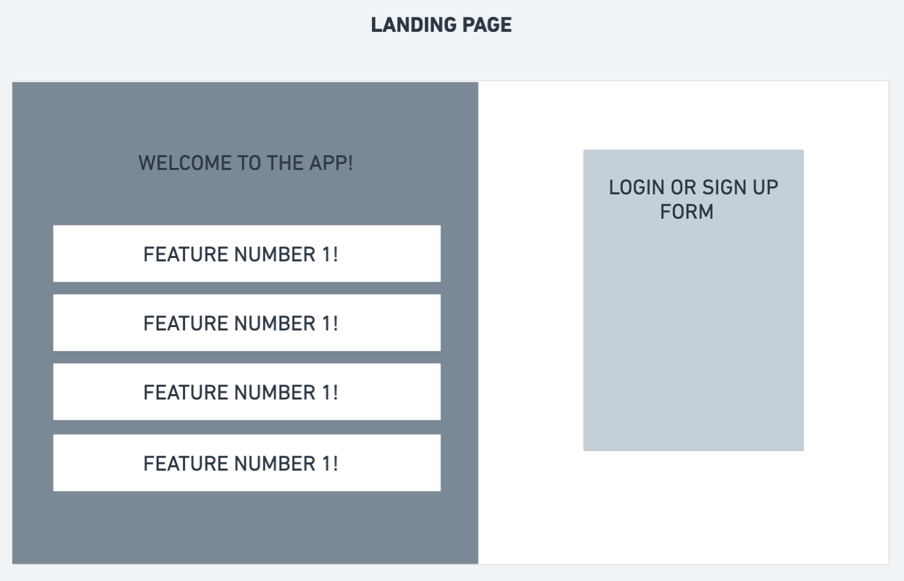
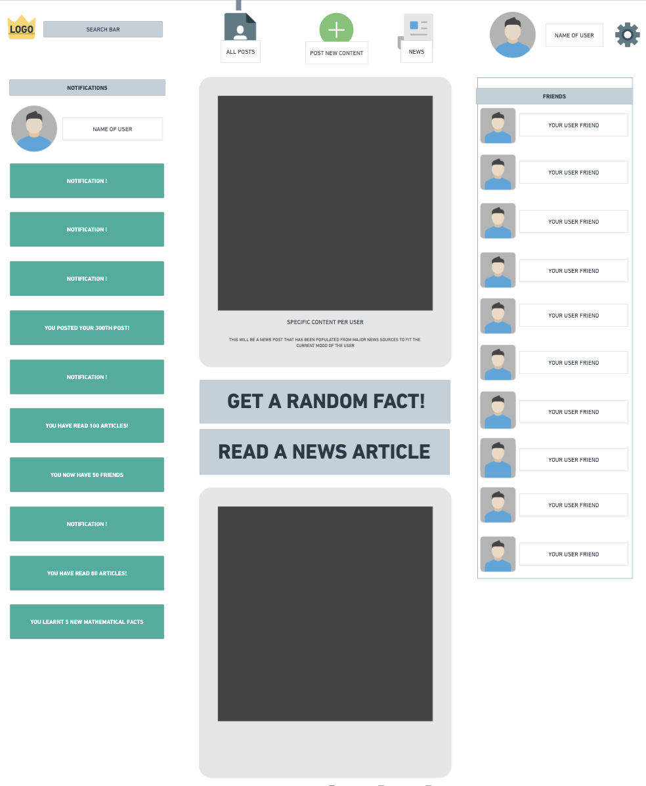
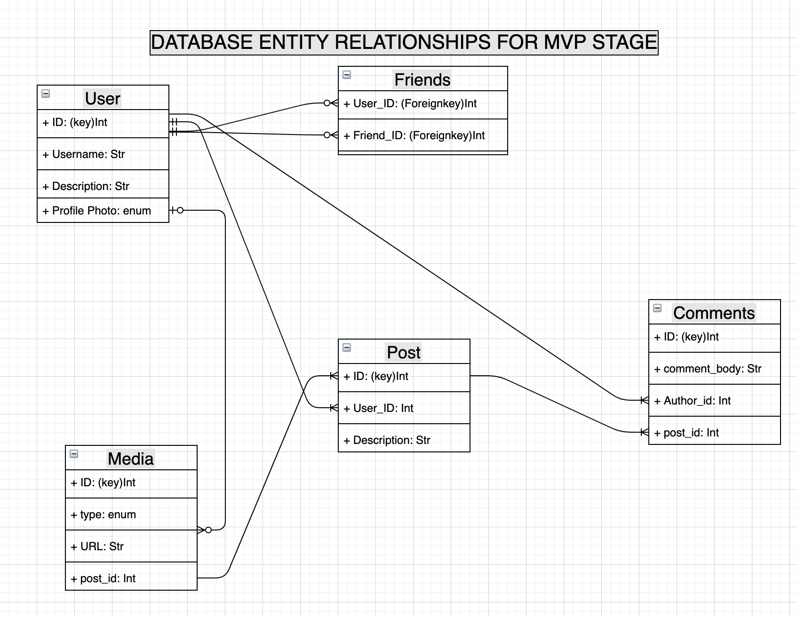

# Coeus-App

## Technologies Used 

- ⚛️ **React Js** 
- 💹 **Node Js**  
- 📄 **Postgres** 
- 🔐 **JWT** 

## Wireframes

### Full WireFrame with user flow:

#### Landing Page

#### Home Page

#### All Posts Page

#### News Page

#### Post Types

#### User Profile Page

#### User Settings Page

#### Entity Relationship Diagram 

 
 

## User Stories

<ul>
<li> The user arrives on a landing page that explains the application. The explanation walks through the following: The social media platform is about promoting inquisitive thought and curiosity and interaction.
<li> Once the user has gone through the landing page, the user will have a chance to sign up to the platform. If the user already has an account, they will be able to login whenever they arrive to the landing page (there will be a consistent login or register button on the right side)
<li> Once logged in or registered, the user will have a homepage that is populated with posts and news articles. The user will be able to use the search bar to look for their friends and add them to their friends list. Doing this will give them access to commenting on their posts, sending them messages and interacting with one another. The user will use the application for communicating with other users, as well as being productive while on the application. The user will have consistent prompts to read or learn new things as they keep interacting with the application.
</ul>

# Questions you might have:

## Why is the App named "Coeus"?
Coeus was the greek titan of inquisition and intellect. Since this social media platform hopes to promote inquisition and intellectual stimulation in regards to learning more things, the symbolism and essence behind the Greek God Coeus is well fitting.

## What to expect in the MVP deployment 

Coeus is an interactive social media platform that allows a user to post photos, write text posts on a single page web application.  Each user post has the ability to be commented on or "liked" by other users as well as "shared". For other users to comment on posts, they must be following each other. In order to find users to follow, all users will have a search bar in their home navigation to use. Each user will have their own personal profile in which they have their own chosen profile picture, profile description/biography and a collection of the posts they have posted. This personal profile is viewable only by people who follow them. 

## Upgrading the MVP to Version 1.0-2.0

- What will Coeus 1.0 - 2.0 versions bring that is not available in the MVP?

The versions post MVP will bring new features with the homepage and added user experience/functionality. The user will be able to change their moods, which will in turn affect what kind of posts will be shown on their profile homepage. The users will also have a level that will effectively progress throughout the user's use of the application. For each article and news read, they will gain points and eventually "level up".

- What is different with Coeus when comparing to other social media platforms?

Coeus seeks to implement a gamification of social interaction and overall interaction within a social media platform. Each user has a choice of how to use the Coeus platform, some may choose to use it to learn daily facts, some may use it to keep updated about the current news or to read and learn daily. The social media platform offers multiple ways to enjoy user to user interaction as well as overall interaction.

- What do you mean by "gamification of social interaction"?
Each user will start from level 0 and have no trophies. For each interaction the user partakes in within the application, the user will gain points and trophies for certain achievements. For each article the user reads fully, they will gain a certain amount of points. The same is applied when users share posts, comment on other peoples posts, read random facts of the day, read the news. 
The reason behind this choice is to create a positive environment to promote learning and social interaction, with the specific overarching 

## Milestones for MVP Stage

Sprint 1 (Thursday Feb 4 - Saturday Feb 6th) -- Setting up the server and basic routes for homepage, landing page, sign up and sign in. Adding React pages, routes and components for the former.

Sprint 2 (Monday 8th Feb - Tuesday 9th Feb) -- Add User Profile page and back end relations, User Posts and ability to Post with images, text and ability to interact with other user profiles (follow unfollow comment like functionality)

Sprint 3 (Wednesday 10th Feb) --  Styling of all pages and adding external API's (News Fetch API, Random Fact Generator).

Sprint 4 Final (Thursday 11th Feb) -- Testing of scalability, functionality and customizing each user's experience by adding accessibility options.

## License

This project is licensed under the MIT License - see the [LICENSE](https://opensource.org/licenses/MIT) page for details.

